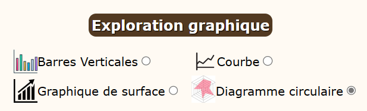
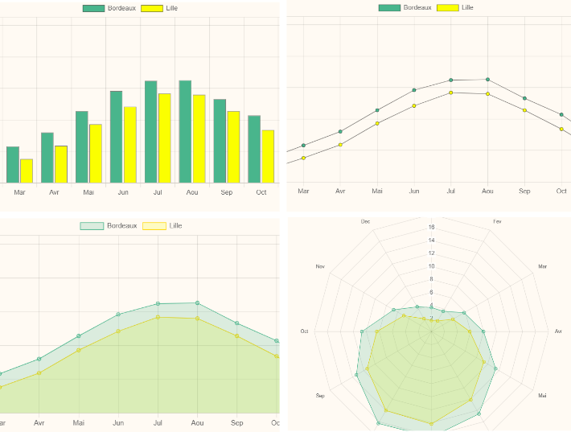
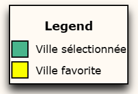

# Laib Nada

# TP5 de Javascript : PROJET 2

## Ce Readme contient les informations suivantes :
  * #### Comment installer les fichiers nécessaires au projet 
  * #### Comment exécuter le projet avec le dev-server
  * #### Etat de mon travail
  * #### Extensions ajoutées
  * #### Cartographie des composants React développés pour le projet

#
### Comment installer les fichiers nécessaires au projet 

Sur mon terminal et dans le dossier tp5 : 

* J'installe toutes les dépendances définies dans le fichier package.json grâce la commande : 
  ```bash  	  
  tp5$  npm install
  ```  

* Création du dossier dist grâce la commande : 

  ```bash  	  
  tp5$  npm run build 
  ```  

### Comment exécuter le projet avec le dev-server

* Toujours sur mon terminal et dans le dossier tp5 exécuter la commande npm run dev-server :

  ```bash
  tp5$  npm run dev-server
  ```
  #### → Ceci démarrera le serveur de développement.

* Aussi, après avoir exécuté <code>npm run dev-server</code> nous pouvons procéder à ces étapes:
  * Exécuter la commande <code>npm run build</code> afin de mettre à jour le dossier dist.
  * Ouvrir le fichier index.html qui se trouve dans le dossier dist.
Ceci ouvrira et affichera le projet.

### Etat de mon travail

* Tout à été réalisé et fonctionne parfaitement.

* Les critères ont également été respectés : 

  * Au démarrage, la ville favorite est la première de la liste de données de meteo-data.js et l'autre ville affichée est la seconde de cette liste. ✅
  * A chaque fois que l'on modifie la ville choisi les données affichées sont modifié en conséquence. ✅
  * Quand on modifie la ville favorite, les données qui lui correspondent, affichées dans le second tableau, sont adaptées. ✅
  * On peut afficher ou masquer le graphique de comparaison des données, en cliquant sur le bouton prévu. ✅
  * Les données dans le graphique, et donc la vue affichée, s'adaptent lors du changement de la ville sélectionnée ou de la ville favorite. ✅
  * On peut choisir le type de données affichées dans le graphique et les données affichées sont alors modifiées. ✅

### Extensions ajoutées

#### Première extension 

* Possibilité à l'utilisateur d'afficher une photo de sa ville favorite.
    * Si l'utilisateur active la case à cocher pour afficher sa ville favorite alors une photo de sa ville favorite est affichée. En revanche, si l'utilisateur désactive la case à cocher, la photo de sa ville favorite disparait de l'affichage.
    * Lorsque l'utilisateur sélectionne une nouvelle ville favorite, la photo est mise à jour en conséquence.

      * En prenant Lille comme exemple de ville favorite, voici ce que l'extension permet de réaliser : 
        
      


#### Deuxième extension 

* L'utilisateur à maintenant la possibilité de choisir le type du graphique parmis 4 options : 
    * Barres verticales (<code>Bar</code>)
    * Courbe (<code>Line</code>)
    * Graphique de surface (<code>Line avec des options ajoutées</code>)
    * Diagramme circulaire (<code>RadarChart</code>)
    
      * Voici la représentation de la selection du type de graphique: 
  
      

      * Voici les différentes représentations générées par chaque type  : 

      

#### Troisième extension

* Une légende à été ajoutée pour permettre à l'utilisateur de distinguer clairement sa ville favorite de sa ville selectionnée.
  * Voici la représentation de cette extension : 

  


#### Quatrième extension 

* Style CSS personnalisé

### Cartographie des composants React développés pour le projet

*Pour les composants DataForCity et DataComparison l'option d'utiliser des tableaux pour l'affichage à été choisie, ainsi le composant MeteoData n'à pas été utilisé en conséquence*

* App
  * DataForCity 
  * SelectCity
  * DataComparison
  * ChartZone
    * Buttons
    * SelectChartType : Extension ajouté
  * DisplayFavoriteImage : Extention ajouté
  * Legend : Extension ajouté
 
*fin du readme, merci pour l'attention apporté à ce document* 
 